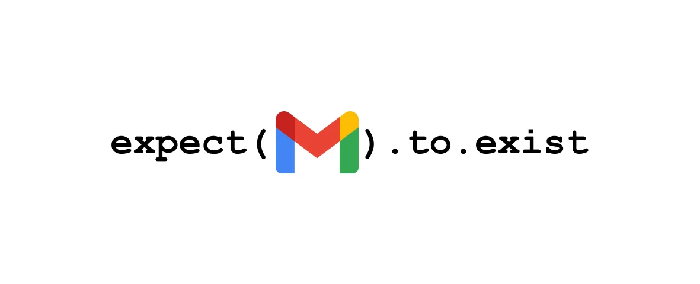
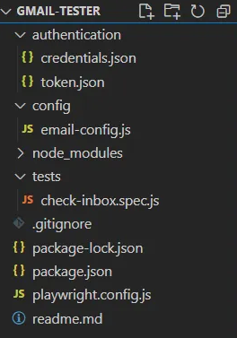
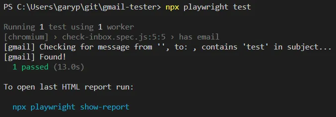

---

## 👋 Introduction

We will be creating some simple tests for email verification - if you work with systems that trigger emails and you need to verify the receipt of them, this setup is what you need.

## Table of contents

## 📚 Prerequisites

- Visual Studio Code
- Playwright
- Node.js
- An OAuth2 Authentication file from https://console.cloud.google.com/apis/credentials, full details on this process can be found here: https://www.npmjs.com/package/gmail-tester

## 💻 Commands

- The ```credentials.json``` is where we will store the values from the **OAuth2 Authentication file.**
- To generate the ```token.json``` we need to run the following command:
```node node_modules/gmail-tester/init.js credentials.json token.json my-email-address@gmail.com```

- It's executed using node - and the script being executed is at this path within your project: ```node_modules/gmail-tester/init.js```
- Replace the email address with the one you want to use (this should be the same one used to generate your authentication file.

## 📁 Project structure
Once you have the authentication files required, this is how I'd suggest structuring your project.

> If you plan to push this to a repository, make sure to store the authentication and any other sensitive data elsewhere / as secrets.



## 🔐 Authentication

This is where we will store our ```credentials.json``` -

```
{
    "installed":{
       "client_id":"",
       "project_id":"",
       "auth_uri":"https://accounts.google.com/o/oauth2/auth",
       "token_uri":"https://oauth2.googleapis.com/token",
       "auth_provider_x509_cert_url":"https://www.googleapis.com/oauth2/v1/certs",
       "client_secret":"",
       "redirect_uris":[
          "http://localhost"
       ]
    }
 }
```
And our ```token.json``` -

```
{
    "access_token":"",
    "refresh_token":"",
    "scope":"https://www.googleapis.com/auth/gmail.readonly",
    "token_type":"Bearer",
    "expiry_date":
 }
```

## ⚙️ Config

The email-config is where we will be storing our parameters for verification, such as ```'subject'```, ```'from'```, ```'to'```.

We will also set values for polling ```'wait_time_sec'``` and maximum wait time ```'max_wait_time_sec'```.

```
import path from "path";
import { fileURLToPath } from "url";

const __dirname = path.dirname(fileURLToPath(import.meta.url));

// config.js
export default {
    credentialsPath: path.resolve(__dirname, "credentials.json"),
    tokenPath: path.resolve(__dirname, "token.json"),
    options: {
      subject: "test email",
      from: "my-email-address@gmail.com",
      to: "my-email-address@gmail.com",
      wait_time_sec: 10,
      max_wait_time_sec: 30,
      include_body: true
    }
  };
```

## 🧪 Tests

```
import gmail from "gmail-tester";
import config from "./config.js";
import { test, expect } from '@playwright/test';

test('has email', async () => {
  const email = gmail.check_inbox(config.credentialsPath, config.tokenPath, config.options);
  expect(await email).toBeTruthy();
});
```

## 🏃 Running the test

It's a fairly quick test to execute and provides information about the parameters you have queried.



## 🏁 Conclusion

This is a simple foundation for building a full email verification test suite, as detailed or complex as necessary. Hopefully, this can bring some value to your product and remove the manual process of checking and verifying email integrations.
