---

## 🔎 What is k6?

> An open-source load testing tool that makes performance testing easy and productive for engineering teams. k6 is free, developer-centric, and extensible.

## Table of contents

## 💼 Who should be using k6?

> k6 users are typically Developers, QA Engineers, SDETs, and SREs. They use k6 for testing the performance and reliability of APIs, microservices, and 
websites.

## 🚀 Getting started

Let’s install k6! — Follow one of these installation processes depending on your platform.

## 🏃‍♂️ Running a test

This is a very basic test to get started, we are making a single request with one user.

Below is the output of that run, where you can see various metrics and data from the request made.

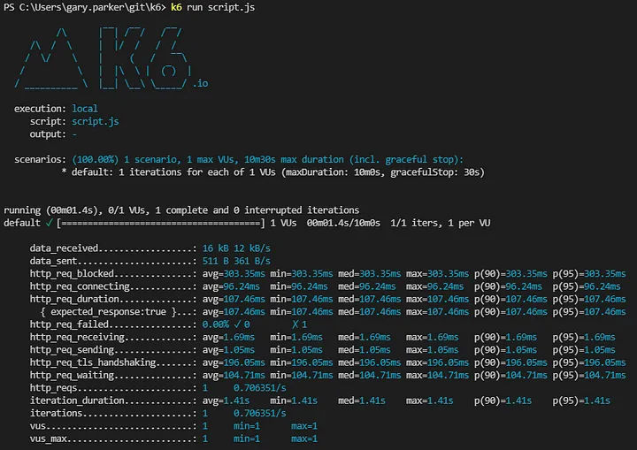

## 🤖 Adding virtual users

Let’s scale it up! The core of performance testing is about sending increased amounts of load/traffic, and k6 makes that very easy to do.

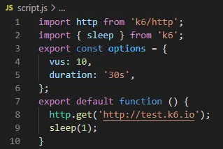

We have 2 options, we can define the vus (virtual users) and duration to run for in the test script.

Or we can pass it as parameters in the command line execution.

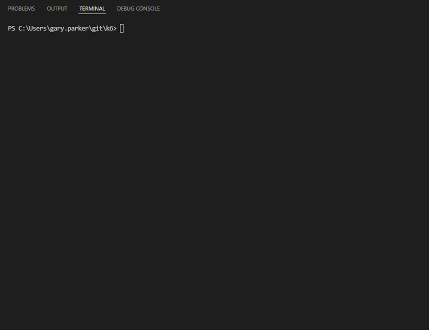

## 📈 Understanding metrics

The link below has the full breakdown of all metrics and definitions, I’m going to give a brief overview of the main ones.

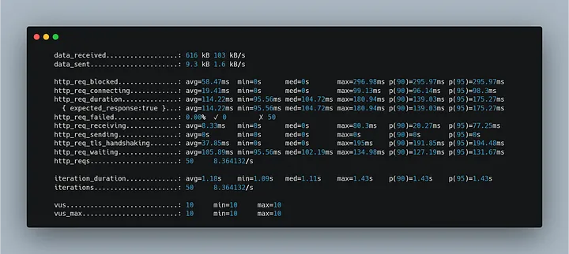

- **data received / data sent** - fairly self-explanatory, if you’re more interested in tracking data transmitted by specific URL’s, there is more detailed documentation in the link below.
- **http requests** - these are broken down into the different states that the request can be in, and the response times during those times
- **iterations** - the amount that were run, and the time it took to complete one full iteration
- **VU’s** - the min and max number of virtual users during that run

## ✅ Adding checks

### Partially failing run

There are two checks in this execution — status code and body size.

As you can see the second check has failed. due to body size being above the defined value.

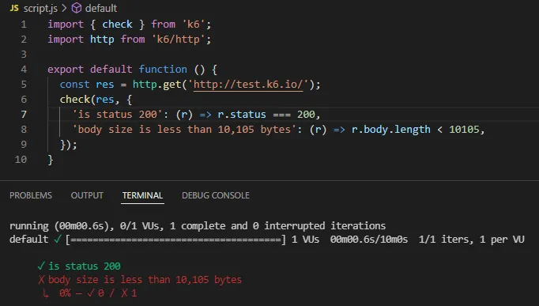

### Successful run

And in this run, we can see all of the checks have been successful for the test execution.

## 🎯 Setting thresholds

Thresholds allow a bit more flexibility with the checks we can implement. In this scenario we have added two thresholds — http errors should be less than 1% and 95% of requests should be below 200ms.

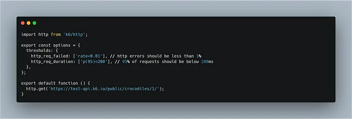

As you can see below, both threshold checks have passed with a green tick — this was executed with 10 virtual users, and the checks were made on every request.

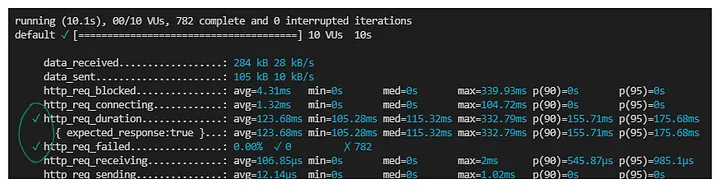

## 📶 Load testing

The goal is to test the performance of the system in terms of concurrent users and requests— In this scenario we are putting the platform under increased load for a period of time.

We are ramping up to 100 users over a 1 minute period, maintaining the 100 users for 2 minutes, and then ramping down to 0 users over a 1 minute period.

There are also some checks and thresholds in place that will execute during the stages of this execution.

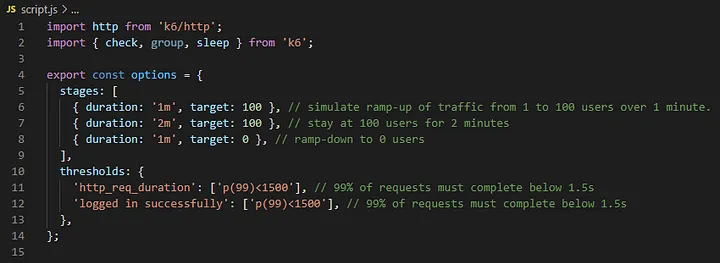

The threshold for request durations being below 1.5 seconds failed, as the average duration was 1.8 seconds.

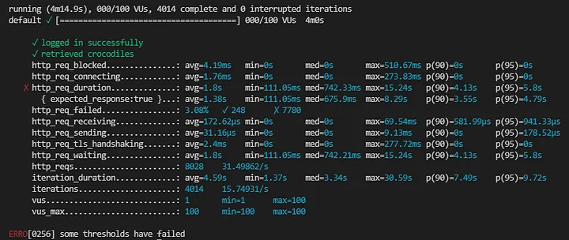

Load Testing is primarily concerned with assessing the current performance of your system in terms of concurrent users…
k6.io

## 🏋️ Stress testing

The goal is to test availability and stability under heavy load—In this approach, we are looking to push the load on the platform beyond its expected breaking point.

We are ramping up from below normal load all the way up to beyond the breaking point — its important to do this in stages, as you’ll be able to analyse how the system behaves at all points.

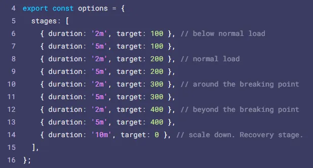

Stress testing is one of the many different types of load testing. While load testing is primarily concerned with…
k6.io

## ⏱️ Soak testing
The goal is to test reliability over time — In this instance we are putting the platform under an increased load for an extended period of time.

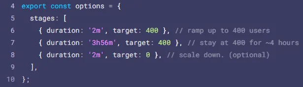

While load testing is primarily concerned with performance assessment, and stress testing is concerned with system…
k6.io

## 🏁 Conclusion
k6 lowers the bar for entry into performance testing and analysis — allowing you to write tests in a language you are familiar with, and get quality checks in place quickly.
