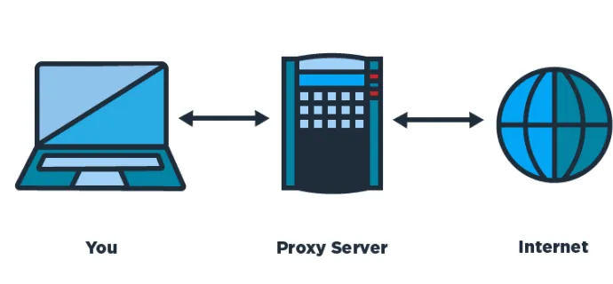
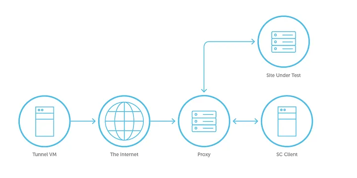
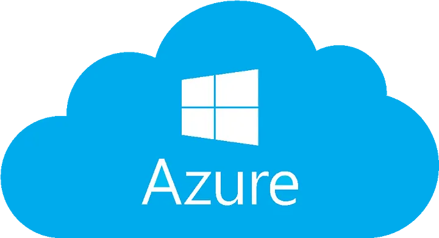
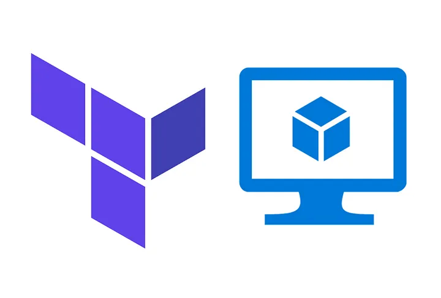
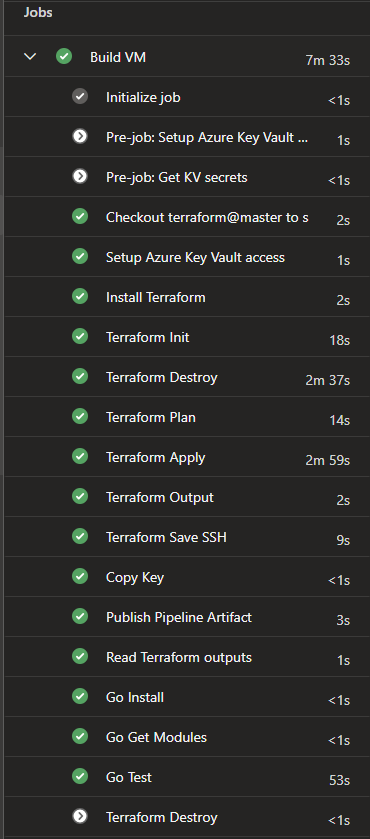
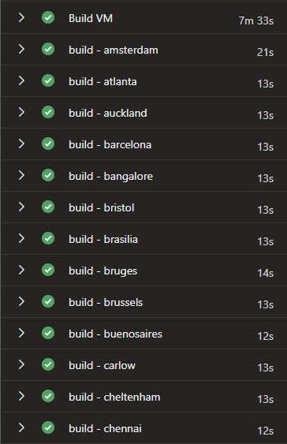
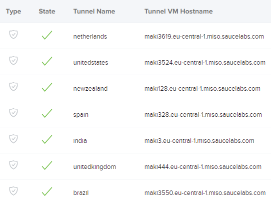

## 👋 Introduction

Testing an application that is used by a global market can be difficult — what platform or device are they using? Where are they located? Does your application behave differently depending on the country they are in, or even the region or city? There is so much complexity involved, and it’s hard to even know where to start.

We are going to outline an approach and infrastructure that enables the testing of web and mobile applications on a global scale. We will discuss the integration of proxies, the creation of tunnels and how we can connect all of this to the Sauce Labs platform.

## Table of contents

## 💻 Proxies, Tunnels, Docker, Sauce and a little bit of coding!

Hmmm... 
- 🔌 Proxies?
- 🚇 Tunnels?
- 🐳 Docker?
- 🍅 Sauce?

What are we talking about here? How is this related to testing?

A little bit confused? Alright .. I must admit it, I was confused too the first time I heard someone talking about this 😀 — So, let me briefly explain what we are talking about in this short post.

## 🔌 What is a proxy?

A Proxy Server is basically a gateway between you and the internet. One of its responsibilities is to drive the internet traffic to the requested address and send back the data received from that particular address to you.

That is not all, there are a lot of functionalities involved in a Proxy Server (They can act as a firewall, web filter, cache data and they also keep the user protected from bad stuff on the internet).



## 🔎 Why should we use them?

A Proxy Server allows us to control internet traffic (Parental control might sound familiar, or if you work in an office, you might be using a Proxy — this is one way to block access to certain sites for example).

Proxies also provide ways to improve internet speed, by caching. They have privacy benefits, by changing the ip address or other information in the web request.

There are different types of proxies:

- Transparent
- Anonymous
- Distorting
- High Anonymity

Let’s move to the other word.. What was it ..? Oh, yes, tunnels!

## 🚇 Let’s build some tunnels!

In Networking, tunneling or port forwarding is the process by which your data packets reach their destinations.

Tunnels transmit the data from a private to a public network, without letting the nodes in that public network know that it is coming from a private one.

## 🍅 Add some Sauce?

By Sauce, we mean Sauce Labs. For those who are not familiar with it, Sauce Labs is a cloud-hosted mobile and web automation testing platform - where we can run tests on web, mobile emulation and real devices using their device farm.


The other feature they provide is “tunnels”. Which provides a secure testing protocol, to test applications behind firewalls, or “Proxies”.

So now, let’s try and connect all these things together. When you are testing an application, sometimes you need to check how the users see it from around the world, for example, if you use different languages. In order to do that, we need what is known as “Localization testing”, in other words, to see how the website or application looks from a different location.

It might sound a little bit complicated, but that is why these tools are here to help us. 

Let’s start with the first one. To simulate how your application looks or behaves from a different location you might need a Proxy Server. At this point, it is all good, however, when you run your tests in the cloud you need to have some security involved, I do not think your company will allow you to direct traffic everywhere without having any control.

Here is where Sauce Labs comes in, they provide Tunnels to run our tests within a secure connection between their platform and our application. Basically, the traffic will go back and forth through that tunnel, ensuring a secure connection.

Now that we’ve gone through these tools, I would like to share how we set up all of them to be able to test our application from different locations, using proxies and tunnels.



## 🏗️ What infrastructure are we dealing with?

> Before we start, its benefical to read through Sauce Labs [documentation](https://docs.saucelabs.com/secure-connections/sauce-connect/setup-configuration/basic-setup/) on Sauce Connect Proxy.

As teams can be continuously releasing features, we needed to have tunnels up and running almost constantly.

We decided to set the tunnels up using an Azure Virtual Machine and experiment with managing this via Terraform.

> If you are not very familiar with Cloud Resources, Terraform is an Infrastructure as Code tool to configure and deploy Infrastructure in different service providers such as AWS, Azure Devops, GCP, etc.

## 🌐 Azure Portal Setup

First of all, we need to have a **Subscription** - this is the container of your technical resources or businesses.



Once we have the Subscription, we can start creating our Resource Group. This will allow us to organize our resources a bit better, by grouping them for easier management, access and cost effectiveness.

We are now ready to start building up our resources in Azure. What resources are we talking about? In this case, as mentioned before, we will build a Virtual Machine to host our Proxy Tunnels.

So, let’s see how we can achieve that using Terraform.

## 🌍 Terraform Setup

> Note: A collaboration with DevOps or a Network Team might be needed, as you might need to know about security rules and networking in order to configure the resource in the right way to be accessible.

- **main.tf**: This is the file that contains the main configuration of your module.
- **providers.tf**: The provider is responsible for enabling the interaction with the API, in this case, will be Azure.
- **variables.tf**: Might sound more familiar.. yes, it is where you can declare your variables to be used across your files.
- **output.tf**: Allows you to export data about your resource.
- **locals.tf**: It is similar to variables, but they are not hardcoded values assigned by the user, they are set locally to the configuration.

Alright, time to see a little bit of Terraform Code.

We will start with a simple one, let’s have a look at **variables.tf**. You can choose your own naming conventions.

```
variable "resource_group_name_prefix" {
  default       = "rg"
  description   = "Prefix of the resource group name"
}

variable "resource_group_name" {
  default       = "prefix_SomeName"
  description   = "Resource group name"
}

variable "resource_group_location" {
  default       = "WestEurope"
  description   = "Location of the resource group."
}

variable "vm_location" {
  default     = "westeurope"
}

variable "azurerm_linux_virtual_machine_name" {
  default     = "resourceprefix-location-environment-project"
}

variable "azure_linux_vm_pcname" {
  default     = "resourceprefix-location-environment-project-pcname"
}

variable "azure_user_admin" {
  default     = "azureuser"
}
```

Now, the **providers.tf**

```
terraform {
 required_providers {
     azurerm = {
     source = "hashicorp/azurerm"
     version = "2.92.0"
   } 
 }

 backend "azurerm" {
    resource_group_name  = "${var.resource_group_name}"
    storage_account_name = "storageaccountname"
    container_name       = "project-tfstate"
    key                  = "project.tfstate"
  }
}
```

Here you can notice how you can start using variables by interpolating them.

Something important to mention is the key “tfstate” file. This will contain all the information about your resource in JSON format.

**output.tf**

```
output "public_ip_address" {
  value = azurerm_linux_virtual_machine.yourvmname.public_ip_address
}

output "azurerm_linux_virtual_machine_name" {
  value     = azurerm_linux_virtual_machine.yourvmname.name
}

output "resource_group_name" {
  value = azurerm_linux_virtual_machine.yourvmname.resource_group_name
}
```

Some of the values exported in the output can help you test your resource before deploying it. Yes, we will also talk about a little bit of Infrastructure Testing.

**locals.tf**

The way we use the locals is to apply multiple security rules on the resource, by looping through them. You will see how it’s done in main.tf

```
locals { 
secrules= {
 ssh = {
    name = "SSH"
    priority = 300
    direction = "Inbound"
    access = "Allow"
    protocol = "Tcp"
    source_port_range = "*"
    destination_port_range = "22"
    source_address_prefix = "ipaddress/portrange"
    destination_address_prefix = "*"
    }
 https = {
    name = "HTTPS"
    priority = 320
    direction = "Inbound"
    access = "Allow"
    protocol = "Tcp"
    source_port_range = "*"
    destination_port_range = "443"
    source_address_prefix = "ipaddress/portrange"
    destination_address_prefix = "*"
    }
  }
}
```

And.. the most important one, **main.tf**. This file is quite big, so we will show you a couple of resources and you can refer to Terraform docs for whatever else you need to create.

**The virtual network**:

```
resource "azurerm_virtual_network" "networkname" {
 name = "${var.resource_group_name}-deparment-vnet"
 address_space = ["addressspace/port"]
 location = var.vm_location
 resource_group_name = var.resource_group_name
}
```

**The subnet**

```
resource "azurerm_subnet" "subnetname" {
 name = "${var.resource_group_name}-deparment-subnet"
 resource_group_name = var.resource_group_name
 virtual_network_name = azurerm_virtual_network.qanetwork.name
 address_prefixes = ["addressprefix/port"]
}
```

**The network interface**

```
resource "azurerm_network_interface" "networkinterfacename" {
 name = "${var.resource_group_name}-department-nic"
 location = var.vm_location
 resource_group_name = var.resource_group_name
 ip_configuration {
 name = "${var.resource_group_name}-department-IpConfig"
 subnet_id = azurerm_subnet.subnetname.id
 private_ip_address_allocation = "Dynamic"
 }
}
```

**The virtual machine**

```
resource "azurerm_linux_virtual_machine" "yourvmname" {
 name = var.azurerm_linux_virtual_machine_name
 location = var.vm_location
 resource_group_name = var.resource_group_name
 network_interface_ids = [azurerm_network_interface.qanic.id]
 size = "Standard_D2s_v3"
 os_disk {
 name = "diskname"
 caching = "ReadWrite"
 storage_account_type = "Premium_LRS"
 }
 source_image_reference {
 publisher = "Canonical"
 offer = "0001-com-ubuntu-server-focal"
 sku = "20_04-lts-gen2"
 version = "latest"
 }
 computer_name = var.azure_linux_vm_pcname
 admin_username = var.azure_user_admin
 admin_password = encryptedpassword
 boot_diagnostics {
 storage_account_uri = azurerm_storage_account.storageaccountname.primary_blob_endpoint
 }
tags = { environment = "yourenvironment" }
}
```

As we also need to run docker in the VM, we added what is called an extension.

```
resource "azurerm_virtual_machine_extension" "vmExtension" {
 name = "hostname"
 virtual_machine_id = azurerm_linux_virtual_machine.yourvmname.id
 publisher = "Microsoft.Azure.Extensions"
 type = "CustomScript"
 type_handler_version = "2.0"
 settings = <<SETTINGS
 {
 "commandToExecute": "curl -fsSL https://get.docker.com -o get-docker.sh && sudo sh get-docker.sh"
 }
SETTINGS
}
```

And finally, as mentioned before, the **security group and rules**.

```
resource "azurerm_network_security_group" "securitygroupname" {
 name = "${var.resource_group_name}-department-SecurityGroup"
 location = var.vm_location
 resource_group_name = var.resource_group_name
}
resource "azurerm_network_security_rule" "securityrulename" {
 for_each = local.secrules 
 name = each.key
 direction = each.value.direction
 access = each.value.access
 priority = each.value.priority
 protocol = each.value.protocol
 source_port_range = each.value.source_port_range
 destination_port_range = each.value.destination_port_range
 source_address_prefix = each.value.source_address_prefix
 destination_address_prefix = each.value.destination_address_prefix
 resource_group_name = var.resource_group_name
 network_security_group_name = azurerm_network_security_group.securitygroup.name
}
```

So, as you can see, we are looping through the security rules declared on the locals.tf file and applying them into the security group.

## 🔧 Azure Devops Configuration



## 📦 Terraform Stages
Now it is time to configure our pipeline to execute the different Terraform Stages:

- Setup
- Build
- Test
- Destroy (if fails)

We’ve decided to create different templates for each of the stages, it means we have 4 different .yaml files.

**setup.yml**: This, as it name indicates, will execute the first steps to setup Terraform, they are:

- **Terraform Install**
- **Terraform Init**

As we are working with azure subscriptions, the way we use to authorize our resources is by using a service principal. Depending on your configuration, you might need different user credentials.

**build.yml**: Build will execute:

- **Terraform Plan**: It will create the execution plan, which basically allows you to preview the changes you will make to the resource.
- **Terraform Apply**: Any changes on the plan will be now applied to your resource/s.
- **Terraform Output**: As we need some data for testing (Yes, we also included some tests as part of our infrastructure), the Output command lets you extract the data from the output variables.
Last one (And probably the most interesting ;)):

**test.yml**: As mentioned above, we have included some testing before deploying the resource. On this stage, we use [Terratest](https://terratest.gruntwork.io/) + [Go](https://go.dev/). This tool allows you to do Unit and Integration tests on your resources. What we are doing in our case is to make sure the Virtual machine is being created properly and the data is matching with what we need.

For example, all the data we need to output from our resource, is compared to make sure the correct IP Address, ports, names, user admin are correct.

## 🚇 Running tunnels on Sauce Labs with Docker
Now in order to spin up the tunnels, we decided to do it using the Sauce Docker Container.

The full documentation can be found [here](https://docs.saucelabs.com/secure-connections/sauce-connect/setup-configuration/docker/). The script might change a little bit depending on what you need to pass to initialize the tunnels and the authorization to execute the command.

The script in Azure Devops will look something like this:

```
- task: Bash@3
displayName: create tunnel
inputs:
targetType: 'inline'
script: |
'docker run -w /datadrive -d \
-t saucelabs/sauce-connect:4.7.0 \
-u $(user) \
-k $(key) \
-x https://eu-central-1.saucelabs.com/rest/v1 \
 - proxy "${{ parameters.proxy }}.wonderproxy.com:11000" \
 - proxy-userpwd $(proxy-userpwd) \
 - tunnel-pool \
 - tunnel-name ${{ parameters.tunnelName }} \
 - no-autodetect \
 - shared-tunnel \
-B all'
```

So, how does everything look in action..

As you can see in the image, this is the first “Stage” of the pipeline, where all the terraform commands get executed:

## 🏗️ Build VM



As you can see in the image, the “Destroy” stage is skipped, as all the tests passed!

Let’s create the tunnels:



And finally, our tunnels are up and running in SauceLabs:



## 📝 Conclusion
Technology moves fast and as you can see, there are a lot of tools out there to learn that can help with your testing goals. You do not need only one to rule it all, getting some ideas, knowledge and practice will allow you to understand how you can mix them to get the best of them to fulfill your needs.

It is getting more interesting and fun (and tricky, sometimes, not going to lie) every day, so do not miss the opportunity and take advantage of what you can use for your testing!.